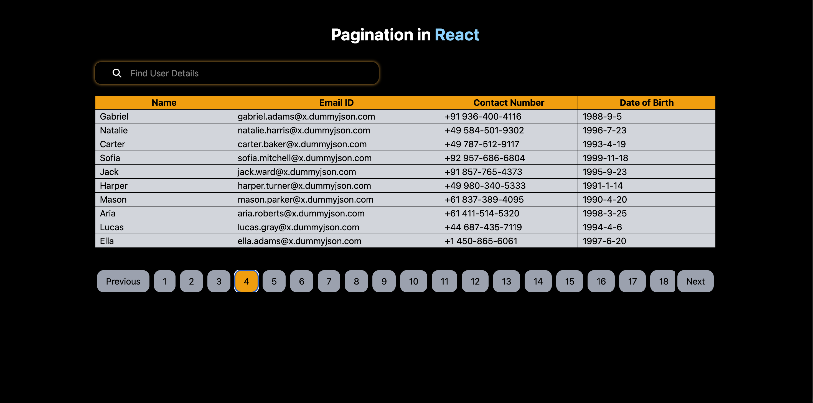
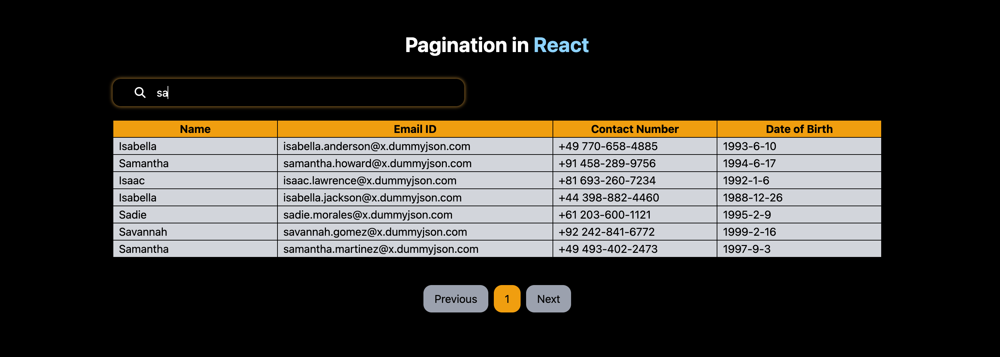

# User Data Table with Pagination

An API-driven user data table built with React that implements client-side pagination, dynamic page navigation controls, search filtering, and comprehensive loading and error state handling.

---

## 🛠 Tech Stack

- React
- JavaScript (ES6+)
- REST API (User data)
- CSS / Tailwind 

---

## ✨ Features

- Fetches user data from an external API
- Displays structured user information in table format
- Client-side pagination (10 records per page)
- Dynamic page number controls (1, 2, 3…)
- Previous and Next navigation buttons
- Automatic disabling of navigation buttons at boundaries
- Search filtering (client-side after data fetch)
- Loading state indicator while fetching data
- Error state handling for failed API requests
- Responsive table layout

---

## 🧠 Key Implementation Details

- Managed paginated data using array slicing logic
- Derived current page data from full dataset state
- Implemented dynamic page number generation
- Controlled navigation boundaries (disable previous/next appropriately)
- Applied conditional rendering for loading and error states
- Implemented client-side filtering without additional API calls

---

## 📸 Screenshots

Data with pagination

Search filtered data 

---

## 📦 Installation

1. Clone the repository

git clone https://github.com/sumanth-git-hub/table-with-pagination.git

2. Navigate into the project directory

cd able-with-pagination

3. Install dependencies

npm install

4. Start the development server

npm run dev

---

## 📌 What I Learned

- Implementing client-side pagination logic
- Managing derived state efficiently in React
- Handling asynchronous data fetching with proper UX states
- Building dynamic navigation controls
- Structuring scalable and reusable table components